 

 
 

 
 

 
 

 
 

<picture>
  <source media="(prefers-color-scheme: dark)" srcset="https://raw.githubusercontent.com/FySystem/FySystem/output/github-contribution-grid-snake-dark.svg" />
  <source media="(prefers-color-scheme: light)" srcset="https://raw.githubusercontent.com/FySystem/FySystem/output/github-contribution-grid-snake.svg" />
  
</picture>

